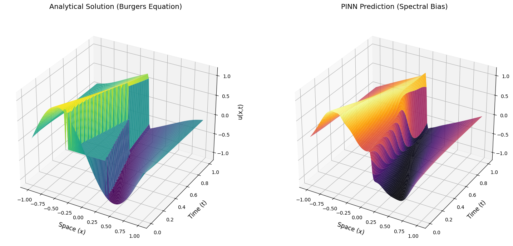
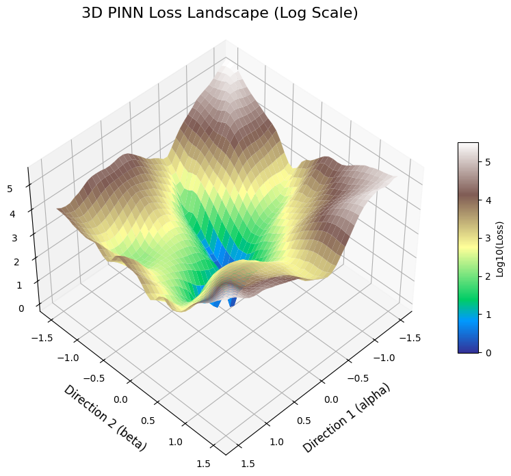

# Geometry-Aware Optimization Diagnostics for Physics-Informed Neural Networks

## Title and Abstract
**Geometry-Aware Optimization Diagnostics for Physics-Informed Neural Networks**

This repository constitutes a rigorous research documentation of my learning journey exploring Physics-Informed Neural Networks (PINNs) through the lens of Riemannian Geometry, Kronecker-Factored Approximate Curvature (K-FAC), and Spectral Bias. The culmination of this study is the **Geometry Scorecard**, a set of diagnostic metrics designed to quantify optimization pathologies in PINNs.

## Motivation & Learning Objectives
The primary purpose of this repository is to build strong mathematical foundations in Scientific Machine Learning and document my progress towards future research endeavors suitable for top-tier Ph.D. programs. It demonstrates:
- The implementation of PINNs.
- Exploration of Loss Landscapes and Optimizer Dynamics.
- Study of the Hessian and Fisher Information Matrices.
- Construction of a reproducible, research-grade open-source repository.

## Repository Structure
- `src/`: Reusable classes and functions with PEP8 docstrings and typing.
- `notebooks/`: Chronological learning notebooks covering theory and experiments.
- `experiments/`: Extracted Python scripts mapping to key milestones (e.g., Hessian Spectrum, K-FAC).
- `docs/`: Learning notes, roadmap, and future research logs.
- `figures/` & `assets/`: Generated visualizations and loss landscapes.

## Mathematical Background
Physics-Informed Neural Networks frequently suffer from optimization difficulties known as *Gradient Pathology*. This can be modeled by analyzing the local geometry of the loss landscape, specifically utilizing the:
* **Hessian Matrix:** Evaluates curvature.
* **Fisher Information Matrix:** Analyzes parameter influence constraints.
* **Gradient Interference:** Computed via cosine similarity between PDE and Data loss gradients.

## The Geometry Scorecard
To diagnose these issues, I implemented the *Geometry Scorecard*, which evaluates:
1. **Condition Number:** Identifying severe ill-conditioning via Riemannian Geometry.
2. **Cosine Similarity:** Flagging conflicting gradient updates.
3. **Spectral Ratio:** Highlighting Spectral Bias (where low frequencies are prioritized over high frequencies).

## Visualizations
### 3D Spatio-Temporal Comparison

### 3D Loss Landscape

## Notebook Guide
Each notebook follows a strict format matching a graduate-level seminar:
1. `01_PINN_Basics.ipynb`: Introduction to PINNs
2. `02_Burgers_Equation.ipynb`: Application to Burgers
3. `03_Differential_Geometry.ipynb`: Differential Geometry & PINNs
4. `04_Geodesics.ipynb`: Geodesic Paths
5. `05_Optimization.ipynb`: Optimization & Spectral Analysis
6. `06_Loss_Landscape.ipynb`: Evaluating Loss Ravines
7. `07_Fisher_Information.ipynb`: Fisher Info metrics
8. `08_Geometric_Experiments.ipynb`: K-FAC Updates
9. `09_Future_Research.ipynb`: Future Paths

## Reproducibility
The code within `src/` and `experiments/` is thoroughly tested and runs on a single Kaggle T4 GPU using PyTorch. See `requirements.txt` for dependencies.

## Citation and License
If you find this learning repository helpful, feel free to use it.
Licensed under the MIT License.
